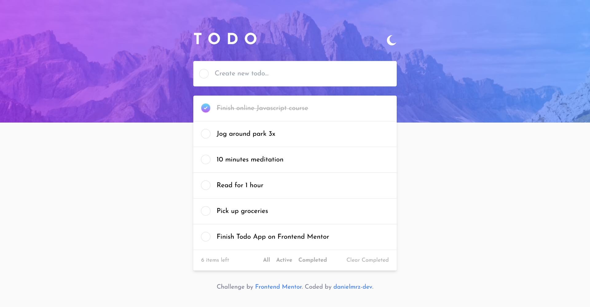

## Welcome! 👋

# Frontend Mentor - Todo app solution

This is a solution to the [Todo app challenge on Frontend Mentor](https://www.frontendmentor.io/challenges/todo-app-Su1_KokOW). Frontend Mentor challenges help you improve your coding skills by building realistic projects. 

## Table of contents

- [Overview](#overview)
  - [Screenshot](#screenshot)
  - [Links](#links)
- [My process](#my-process)
  - [Built with](#built-with)
  - [What I learned](#what-i-learned)
- [Author](#author)
- [Acknowledgments](#acknowledgments)

## Overview

### The challenge

Users should be able to:

- View the optimal layout for the app depending on their device's screen size
- See hover states for all interactive elements on the page
- Add new todos to the list
- Mark todos as complete
- Delete todos from the list
- Filter by all/active/complete todos
- Clear all completed todos
- Toggle light and dark mode

### Screenshot

### Links

- Solution URL: [Link](https://www.frontendmentor.io/solutions/todo-app-built-with-sass-tailwind-and-javascript-a8HvpJJ_sl)
- Live Site URL: [Link](https://todo-app-eight-coral.vercel.app/)

## My process

### Built with

- Semantic HTML5 markup
- SASS
- Tailwind
- Grid
- Mobile-first workflow
- Vanilla JavaScript

## Author

- Frontend Mentor - [@danielmrz-dev](https://www.frontendmentor.io/profile/danielmrz-dev)
- Twitter - [@danielmrz_dev](https://www.twitter.com/danielmrz_dev)
